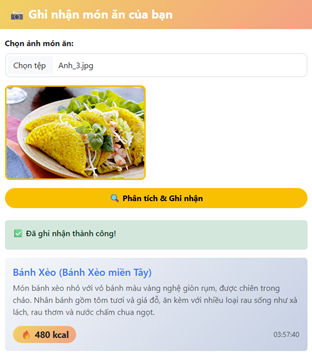
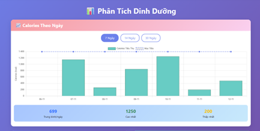
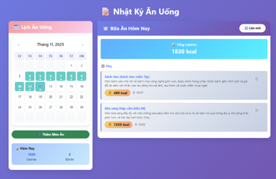
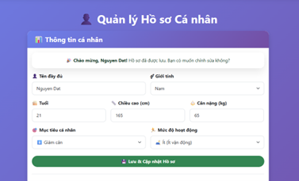

<h2 align="center">
    <a href="https://dainam.edu.vn/vi/khoa-cong-nghe-thong-tin">
    🎓 Faculty of Information Technology (DaiNam University)
    </a>
</h2>
<h2 align="center">
   HỆ THỐNG QUẢN LÝ DINH DƯỠNG CÁ NHÂN. 
</h2>
</h2>

    

        
        
        
    

---

## 📖 1. Giới thiệu

Ứng dụng được xây dựng theo mô hình **Client-Server**, với các đặc điểm chính:
- **Giao diện:** phát triển bằng **HTML5, CSS3, JavaScript** và **Bootstrap 5**.  
- **Backend:** xử lý bằng **Python Flask** với kiến trúc RESTful API.  
- **AI Integration:** tích hợp **Google Gemini AI** cho phân tích hình ảnh và gợi ý thông minh.  
- **Dữ liệu:** lưu trữ cục bộ dưới dạng **JSON Database**.  

Mục tiêu của hệ thống là mang lại trải nghiệm quản lý dinh dưỡng **thông minh, trực quan và cá nhân hóa**, giúp người dùng đạt được mục tiêu sức khỏe một cách khoa học.

### ⚡ Các tính năng nổi bật
- **📸 Phân tích món ăn bằng AI** - Tự động nhận diện và ước tính calories từ hình ảnh
- **🎯 Gợi ý thực đơn thông minh** - Đề xuất món ăn phù hợp với mục tiêu cá nhân
- **📊 Theo dõi dinh dưỡng trực quan** - Biểu đồ phân tích xu hướng ăn uống
- **📝 Nhật ký ăn uống đa dạng** - Lịch sử chi tiết với đầy đủ thông tin dinh dưỡng
- **👤 Quản lý hồ sơ cá nhân** - Tính toán TDEE và calories mục tiêu tự động

---

## 🔧 2. Công nghệ sử dụng

---

## 🖼️ 3. Hình ảnh hệ thống

<small><em>Giao diện trang chủ - Phân tích món ăn & Gợi ý thực đơn</em></small>

    

<small><em>Giao diện biểu đồ - Phân tích dinh dưỡng & Xu hướng</em></small>

    

<small><em>Giao diện nhật ký - Lịch sử ăn uống & Quản lý bữa ăn</em></small>

    

<small><em>Giao diện hồ sơ - Quản lý thông tin cá nhân & Mục tiêu</em></small>

    

---

## 📩 4. Liên hệ.
    - 📧 Email: wayzedgolden@gmail.com
